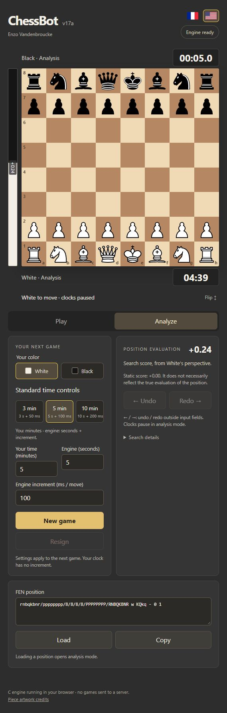

# ChessBot

A chess engine I built in C to learn about game-tree search, data representation
and performance. The current version, **v17a**, can be played in the browser through
WebAssembly.

## Why I built it

I started ChessBot in Java after watching Sebastian Lague's chess programming
videos. I wanted to practice object-oriented programming on a project I could
visualize and improve through experiments: make two versions play against each
other and compare their results.

Moving to C gave me a reason to learn more about memory locality, fixed arrays,
allocation costs and the work done inside the search loop. Move generation was
one of the hardest parts; perft and divide tests helped me track down mistakes.
I also learned that a search optimization recommended in the literature does not
necessarily improve my engine, so I kept earlier versions for comparison.

## What's inside

- Magic bitboards for sliding attacks, using magic numbers I searched myself.
- Iterative deepening, alpha-beta/PVS and quiescence search.
- Zobrist hashing and transposition tables.
- Move ordering with SEE, killer moves, history and countermoves.
- Selective search: null-move pruning, late-move reductions, futility pruning
  and singular extensions.
- Classical evaluation based on PeSTO tables, with pawn structure, bishop pair,
  rook activity and king safety terms.
- Dynamic time management and optional Polyglot opening books.

The browser interface supports play, analysis, clocks, undo/redo and FEN loading.
The C engine runs locally in the browser; there is no server-side engine.

## Try it yourself

On Windows, install Git and Python, then run these commands from the repository
root. Setup installs the Emscripten toolchain locally; it only needs to run once.

```powershell
powershell -NoProfile -ExecutionPolicy Bypass -File .\setup-web.ps1
powershell -NoProfile -ExecutionPolicy Bypass -File .\web.ps1
```

Open <http://127.0.0.1:8080/>. See the [browser guide](docs/WEB.md) for controls
and build options.



## Build and test

For the native programs, I use Windows x64 with MinGW-w64 GCC and PowerShell.
Put the compiler's `bin` directory on PATH, then run:

```powershell
powershell -NoProfile -ExecutionPolicy Bypass -File .\build.ps1
powershell -NoProfile -ExecutionPolicy Bypass -File .\test.ps1 -Configuration Release -Extended
```

Release builds use `-O3` without `-march=native`. The tests cover move encoding,
FEN, special moves, state restoration, hashes, evaluation and reference perft
positions. [Build details](docs/BUILD.md) and [test coverage](docs/TESTING.md)
are documented separately.

## Results and development

In earlier tests, I estimated v17 at **2787 ± 16 Elo** against limited-strength
Stockfish, using 3 seconds + 50 ms per move. This is a calibration estimate,
not a tournament rating. The [version history](docs/VERSIONS.md) records the
changes and measurements from development.

I now use a common [benchmark protocol](docs/METRICS.md) to compare v10–v17a:
paired matches against Stockfish and the previous version, plus nodes/s and
completed depth at a fixed time budget. Each run saves a results table and the
underlying measurements and games.

I'd like to explore NNUE evaluation next and add a standalone UCI interface.
The NNUE experiment is not included here.

## Credits

I learned from Sebastian Lague's videos and the Chess Programming Wiki. PeSTO
tables are by Ronald Friederich; the piece artwork is by Cburnett. Sources and
third-party notices are in [ACKNOWLEDGMENTS.md](ACKNOWLEDGMENTS.md).

[Enzo Vandenbroucke](https://github.com/enzovandenbroucke)
